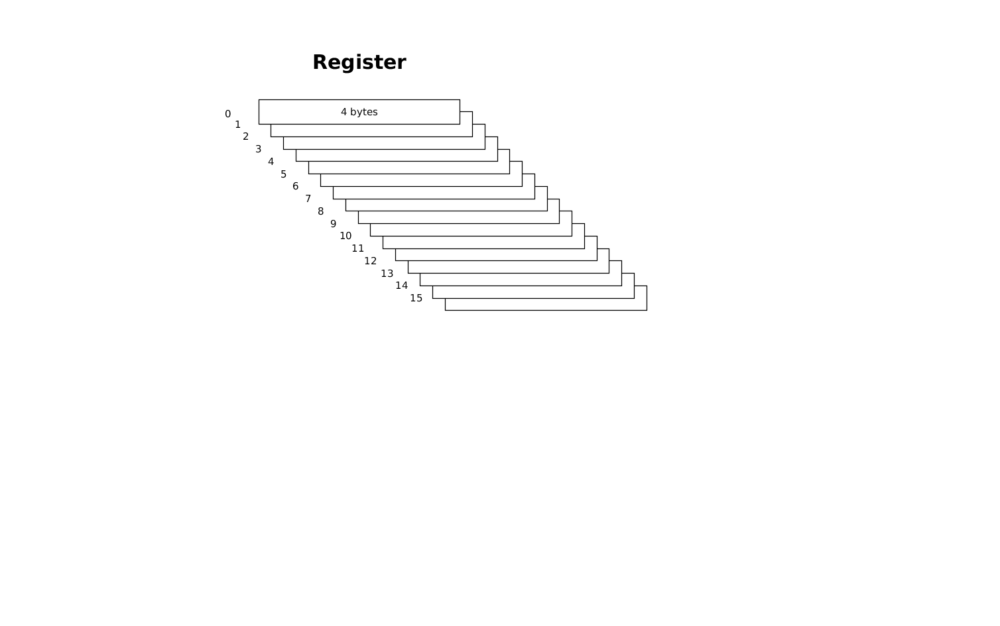
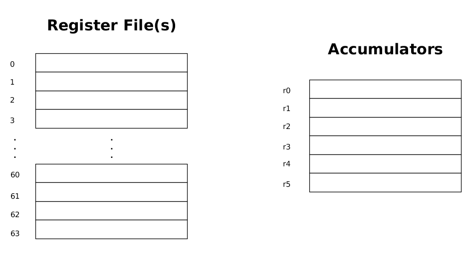

# VideoCore Basics - What you need to know

In order to effectively program on the `VideoCore`, you need a working model of its functionality
in your head. This document describes the bare minimum you need to know.

The text applies to both `vc4` and `v3d`. Where there are differences, it will be explicitly noted.

We start with the most essential thing to understand.

## Registers

The basic storage location within the VideoCore is a register. It is a 32-bit wide location which
in the majority of cases contains an integer or float value.

The most important thing to wrap your brain around is that a register is also **16 values deep**.
A single register represents 16 distinct values.

Within the project, this stack of 16 32-bit wide values is called a **16-vector**, or **vector** for short.

A single instruction working on registers, will perform the operation on *all* register values, pairing
the elements by their position and working on each pair.

For example, an add operation working on two registers `ACC0` and `ACC1`:

    add ACC0, ACC0, ACC1      // first operand is destination
	
with:

    ACC0 = <10 11 12 13 14 15 16 17 18 19 20 21 22 23 24 25>
	ACC1 = <20 21 22 23 24 25 26 27 28 29 30 31 32 33 34 35>

will result in `ACC0` having a value:

    ACC0 = <30 32 34 36 38 40 42 44 46 48 50 52 54 56 58 60>

Every location in the vector has an associated offset, which in the source language code can be
specified with **index()**. For example:

    Where (index() < 8)
      ACC0 = 2
    End
   
will set locations 0..7 to value 2 in register `ACC0`. The remaining locations will be unchanged.

## Register Files

There are 64 general registers organized in one or two **register files**. `vc4` has two register files
A and B, each containing 32 registers, `v3d` has a single register file with 64 registers.

In addition, there are 6 **accumulators**, dubbed `ACC0` to `ACC5`. Usage of these can improve the
efficiency of the operations, especially for `vc4`. `ACC4` and `ACC5` have specific usage for IO and
some extended operations.
