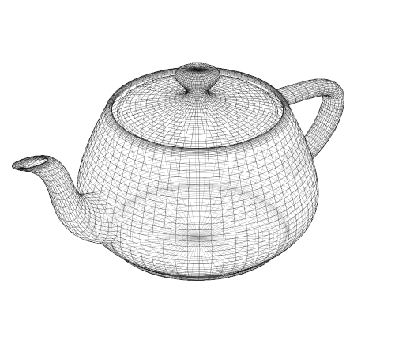
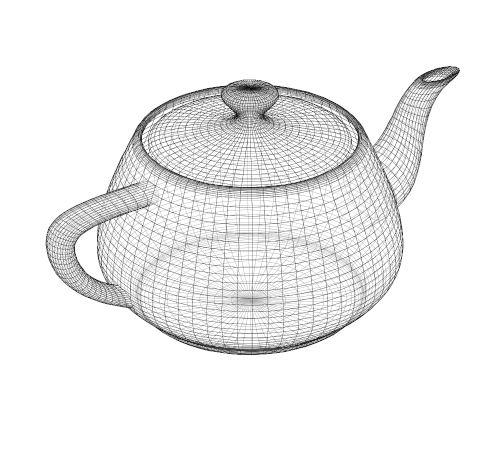
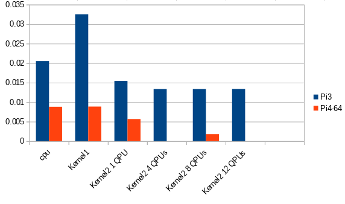
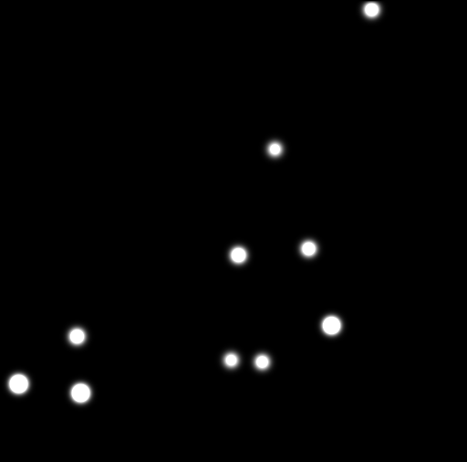

[//]: # (Construct `<a name="performance-1"></a>` is used to disambiguate internal links)
[//]: # (This is not required for unambiguous links, `markdown` and/or `gitlit` can deal with these)


# Examples

## Contents

* [Overview of Examples](#overview-of-examples)
* [Example 1: Euclid's Algorithm](#example-1-euclids-algorithm)
    * [Scalar version](#scalar-version)
    * [Vector version 1](#vector-version-1)
    * [Invoking the QPUs](#invoking-the-qpus)
    * [Vector version 2: loop unrolling](#vector-version-2-loop-unrolling)
* [Example 2: 3D Rotation](#example-2-3d-rotation)
    * [Scalar version](#scalar-version-1)
    * [Vector version 1](#vector-version-1-1)
    * [Vector version 2: non-blocking memory access](#vector-version-2-non-blocking-memory-access)
    * [Performance](#performance)
* [Example 3: 2D Convolution (Heat Transfer)](#example-3-2d-convolution-heat-transfer)
    * [Scalar version](#scalar-version-2)
    * [Vector version](#vector-version)
    * [Performance](#performance-1)


## Overview of Examples

To build and run an example:

```
make QPU=1 <name>
sudo obj/qpu/bin/<name>
```

Interesting examples (there are more):

- **GCD**       - [Euclid's algorithm](https://en.wikipedia.org/wiki/Euclidean_algorithm), The GCD's of some random pairs of integers
- **Tri**       - Computes [triangular numbers](https://en.wikipedia.org/wiki/Triangular_number), using two kernels:
  1. with integer in- and output
  2. with float in- and output
- **OET**       - [Odd-even transposition sorter](https://en.wikipedia.org/wiki/Odd%E2%80%93even_sort) for 32 integers
- **HeatMap**   - Modelling heat flow across a 2D surface; outputs an image in [pgm](http://netpbm.sourceforge.net/doc/pgm.html) format, and notes the time taken
- **Rot3D**     -  3D rotation of a random object; outputs the time taken


## Example 1: Euclid's Algorithm

Given a pair of positive integers larger than zero, 
[Euclid's algorithm](https://en.wikipedia.org/wiki/Euclidean_algorithm).
computes the largest integer that divides into both without a
remainder, also known as the *greatest common divisor*, or GCD for
short.

We present two versions of the algorithm:

  1. a **scalar** version that runs on the ARM CPU and computes a
     single GCD; and

  2. a **vector** version that runs on a single QPU and computes 16
     different GCDs in parallel.

### Scalar version

In plain C++, we can express the algorithm as follows.

```C++
void gcd(int* p, int* q, int* r) {
  int a = *p;
  int b = *q;

  while (a != b) {
    if (a > b) 
      a = a-b;
    else
      b = b-a;
  }
  *r = a;
}
```

Admittedly, it's slightly odd to write `gcd` in this way, operating
on pointers to integers rather than integers directly.  However, it
prepares the way for the vector version which operates on 
*arrays* of inputs and outputs.

### Vector version 1

Using `V3DLib`, the algorithm looks as follows.

```c++
void gcd(Int::Ptr p, Int::Ptr q, Int::Ptr r) {
  Int a = *p;
  Int b = *q;

  While (any(a != b))
    Where (a > b)
      a = a-b;
    End
    Where (a < b)
      b = b-a;
    End
  End

  *r = a;
}
```

This example introduces a number of concepts:

  * the `Int` type denotes a 16-element vector of 32-bit integers;
  * the `Int::Ptr` type denotes a 16-element vector of *addresses* of
    `Int` vectors;
  * the expression `*p` denotes the `Int` vector in memory starting at address
    <tt>p<sub>0</sub></tt>, i.e. starting at the *first* address in the
    vector `p`;
  * the expression `a != b` computes a vector of booleans via a 
    pointwise comparison of vectors `a` and `b`;
  * the condition `any(a != b)` is true when *any* of the booleans in the
    vector `a != b` are true;
  * the statement `Where (a > b) a = a-b; End` is a conditional assigment:
    only elements in vector `a` for which `a > b` holds will be
    modified.

It's worth reiterating that `V3dLib` is just standard C++ code: there
are no pre-processors being used other than the standard C pre-processor.
All the `V3DLib` language constructs are simply classes, functions, and macros exported by `V3DLib`.
This kind of language is called a
[Domain Specific Embedded Language](http://cs.yale.edu/c2/images/uploads/dsl.pdf).


### Invoking the QPUs

The following program computes 16 GCDs in parallel on a single QPU:

```c++
int main(int argc, const char *argv[]) {
  settings.init(argc, argv);

  auto k = compile(gcd);                 // Construct the kernel

  Int::Array a(16), b(16), r(16);        // Allocate and initialise the arrays shared between ARM and GPU
  srand(0);
  for (int i = 0; i < 16; i++) {
    a[i] = 100 + (rand() % 100);
    b[i] = 100 + (rand() % 100);
  }

  k.load(&a, &b, &r);                    // Invoke the kernel
  settings.process(k);

  for (int i = 0; i < 16; i++)           // Display the result
    printf("gcd(%i, %i) = %i\n", a[i], b[i], r[i]);
  
  return 0;
}
```

Explanation:

  * `compile()` takes a function defining a QPU computation and returns a
    CPU-side handle that can be used to invoke it;
  * the handle `k` is of type `Kernel<Int::Ptr, iInt::Ptr, Int::Ptr>`,
    capturing the types of `gcd`'s parameters,
    but we use the `auto` keyword to avoid clutter;
  * when the kernel is invoked by writing `k(&a, &b, &r)`, `V3DLib` 
    automatically converts CPU values of type
    `Int::Array*` into QPU values of type `Int::Ptr`;
  * Type `Int::Array` is derived  from `SharedArray&lt;&alpha;&gt;` which is used to allocate
    memory that is accessible by both the CPU and the QPUs.
    memory allocated with `new` and `malloc()` is not accessible from the QPUs.

Running this program produces the output:

```
gcd(183, 186) = 3
gcd(177, 115) = 1
gcd(193, 135) = 1
gcd(186, 192) = 6
gcd(149, 121) = 1
gcd(162, 127) = 1
gcd(190, 159) = 1
gcd(163, 126) = 1
gcd(140, 126) = 14
gcd(172, 136) = 4
gcd(111, 168) = 3
gcd(167, 129) = 1
gcd(182, 130) = 26
gcd(162, 123) = 3
gcd(167, 135) = 1
gcd(129, 102) = 3
```

### Vector version 2: loop unrolling

[Loop unrolling](https://en.wikipedia.org/wiki/Loop_unrolling) is a
technique for improving performance by reducing the number of costly
branch instructions executed.

The QPU's branch instruction is costly: it requires three
[delay slots](https://en.wikipedia.org/wiki/Delay_slot) (that's 12 clock cycles),
and this project currently makes no attempt to fill these slots with useful work.
Although loop unrolling is not done automaticlly,
it is straightforward use a C++ loop to generate multiple QPU statements.

```c++
void gcd(Int::Ptr p, Int::Ptr q, Int::Ptr r) {
  Int a = *p;
  Int b = *q;
  While (any(a != b))
    // Unroll the loop body 32 times
    for (int i = 0; i < 32; i++) {
      Where (a > b)
        a = a-b;
      End
      Where (a < b)
        b = b-a;
      End
    }
  End
  *r = a;
}
```


## Example 2: 3D Rotation

This example illustrates a routine to rotate 3D objects.

([OpenGL ES](https://www.raspberrypi.org/documentation/usage/demos/hello-teapot.md)
is probably a better idea for this if you need to rotate a lot.
This example is just for illustration purposes)

If this is applied to the vertices of
[Newell's teapot](https://github.com/rm-hull/newell-teapot/blob/master/teapot)
(rendered using [Richard Hull's wireframes](https://github.com/rm-hull/wireframes) tool):

|  |  |
|:---:|:---:|
| &theta; = 0&deg; | &theta; = 180&deg; |

### <a name="scalar-version-1">Scalar version</a>

The following function will rotate `n` vertices about the Z axis by
&theta; degrees.

```c++
void rot3D(int n, float cosTheta, float sinTheta, float* x, float* y) {
  for (int i = 0; i < n; i++) {
    float xOld = x[i];
    float yOld = y[i];
    x[i] = xOld * cosTheta - yOld * sinTheta;
    y[i] = yOld * cosTheta + xOld * sinTheta;
  }
}
```

### <a name="vector-version-1-1"></a>  Vector version 1

This first vector version is almost identical to the scalar version above.
The only difference is that each loop iteration now processes 16 vertices at a time rather than a single vertex.

```c++
void rot3D_1(Int n, Float cosTheta, Float sinTheta, Float::Ptr x, Float::Ptr y) {
  For (Int i = 0, i < n, i += 16)
    Float xOld = x[i];
    Float yOld = y[i];
    x[i] = xOld * cosTheta - yOld * sinTheta;
    y[i] = yOld * cosTheta + xOld * sinTheta;
  End
}
```

This simple solution will spend a lot of time blocking on the memory subsystem, waiting for vector reads and write to complete.
The next section explores how to improve performance by overlapping memory access with computation.


### Vector version 2: non-blocking memory access 

`V3DLib` supports explicit non-blocking loads through these functions:

| Operation        | Description                                                                  |
|------------------|------------------------------------------------------------------------------|
| `gather(p)`      | Given a vector of addresses `p`, *request* the value at each address in `p`. |
|                  | A maximum of 8 gather calls can be outstanding at any one time.              |
|                  | For more than 8, the QPU will block *(TODO verify)*.                         |
| `receive(x)`     | Loads values collected by `gather(p)` and stores these in `x`.               |
|                  | Will block if the values are not yet available.                              |
| `prefetch(x, p)` | Combines `gather` and `receive` in an efficient manner. `gather` is          |
|                  | performed as early as possible. There are restrictions to its usage *(TODO)* |

These are all read operations, the write operation can not be optimized.

 - On `vc4` a write operation has to wait for a previous write operation to complete.
 - On `v3d`, a write operation does not block and always overlaps with QPU computation.

Between `gather(p)` and `receive(x)` the program is free to perform computation *in parallel*
with the memory accesses.

Inside the QPU, an 8-element FIFO, called the **TMU**, is used to hold `gather` requests:
each call to `gather` will enqueue the FIFO, and each call to `receive` will dequeue it.
This means that a maximum of eight `gather` calls may be issued before a `receive` must be called.

A vectorised rotation routine that overlaps memory access with computation might be as follows:

```c++
void rot3D_2(Int n, Float cosTheta, Float sinTheta, Float::Ptr x, Float::Ptr y) {
  Int inc = numQPUs() << 4;
  Float::Ptr p = x + me()*16;
  Float::Ptr q = y + me()*16;

  gather(p); gather(q);
 
  Float xOld, yOld;
  For (Int i = 0, i < n, i += inc)
    gather(p+inc); gather(q+inc); 
    receive(xOld); receive(yOld);

    *p = xOld * cosTheta - yOld * sinTheta;
    *q = yOld * cosTheta + xOld * sinTheta;
    p += inc; q += inc;
  End

  receive(xOld); receive(yOld);
}
```

(**TODO** same example with `prefetch()`)

While the outputs from one iteration are being computed and written to
memory, the inputs for the *next* iteration are being loaded *in parallel*.

Variable `inc` is there to take into account multiple QPU's running.
Each QPU will handle a distinct block of 16 elements.


### Performance

Times taken to rotate an object with 192,000 vertices:

```
Raspberry Pi 3 Model B Rev 1.2 (vc4):

  Version  | Number of QPUs | Run-time (s) |
  ---------| -------------- | ------------ |
  Scalar   |  0             | 0.020532     |
  Kernel 1 |  1             | 0.032531     |
  Kernel 2 |  1             | 0.015441     |
  Kernel 2 |  4             | 0.013367     |
  Kernel 2 |  8             | 0.013368     |
  Kernel 2 | 12             | 0.013386     |

Raspberry Pi 4 Model B Rev 1.1 (64-bits, v3d):

  Version  | Number of QPUs | Run-time (s) |
  ---------| -------------- | ------------ |
  Scalar   |  0             | 0.008814     |
  Kernel 1 |  1             | 0.008867     |
  Kernel 2 |  1             | 0.00566      |
  Kernel 2 |  8             | 0.001803     |

```




Non-blocking loads (Kernel 2) give a significant performance boost: in this case a factor of 2.

On `vc4`, this program does not scale well to multiple QPUs.
This is likely because the compute-to-memory ratio is too low:
only 3 arithmetic operations (2 multiplications, 1 addition/substraction)
are done for every memory access, perhaps overwhelming the memory subsystem.

Example `Mandelbrot` had a much better compute-to-memory ratio, and is therefore a better candidate for
measuring computing performance with respect to scaling.

On `v3d`, this *does* scale with the QPUs. This is a good indication that the memory handling has been improved in this model.
In addition, it is significantly faster overall.


## Example 3: 2D Convolution (Heat Transfer)

This example models the heat flow across a 2D surface.
[Newton's law of cooling](https://en.wikipedia.org/wiki/Newton%27s_law_of_cooling)
states that an object cools at a rate proportional to the difference
between its temperature `T` and the temperature of its environment (or
ambient temperature) `A`:

```
   dT/dt = −k(T − A)
```

In the simulation, each point on the 2D surface to be a separate object,
and the ambient temperature of each object to be the average of the temperatures of the 8 surrounding objects.
This is very similar to 2D convolution using a mean filter.

The `HeatMap` example program initializes a number of heat points and then
iteratively calculates the diffusion.
The following images show what happens with progressive iterations:

|  |  |  |
|:---:|:---:|:---:|
| 0 steps | 100 steps | 1500 steps |


### <a name="scalar-version-2"></a> Scalar Version

The following function simulates a single time-step of the
differential equation, applied to each object in the 2D grid.

```c++
void scalar_step(float** map, float** mapOut, int width, int height) {
  for (int y = 1; y < height-1; y++) {
    for (int x = 1; x < width-1; x++) {
      float surroundings =
        map[y-1][x-1] + map[y-1][x]   + map[y-1][x+1] +
        map[y][x-1]   +                 map[y][x+1]   +
        map[y+1][x-1] + map[y+1][x]   + map[y+1][x+1];
      surroundings *= 0.125f;
      mapOut[y][x] = (float) (map[y][x] - (K * (map[y][x] - surroundings)));
    }
  }
}
```


### Kernel Version

The kernel program uses a **cursor** to iterate over the values.
The cursor implementation for `HeatMap` preloads and iterates over three consecutive lines simultaneously.
This allows for a kernel program to access all direct neighbors of a particular location.

Conceptually, you can think of it as follows:

```
               prev     current    next
columns:       i - 1       i       i + 1
            +---------+---------+---------+
line j -1   |         |         |         |
            +---------+---------+---------+
line j      |         | (i , j) |         |
            +---------+---------+---------+
line j + 1  |         |         |         |
            +---------+---------+---------+
```
Keep in mind, though, that in the implementation every cell is actually a 16-vector,
and represents 16 consecutive values.


For the kernel program, a 1D-array with a width offset ('pitch') is used to implement the 2D array.
The kernel simulation step using cursors is expressed below (taken from example `HeatMap`).


```C++
/**
 * Performs a single step for the heat transfer
 */
void heatmap_kernel(Float::Ptr map, Float::Ptr mapOut, Int height, Int width) {
  Cursor cursor(width);

  For (Int offset = cursor.offset()*me() + 1,
       offset < height - cursor.offset() - 1,
       offset += cursor.offset()*numQPUs())

    Float::Ptr src = map    + offset*width;
    Float::Ptr dst = mapOut + offset*width;

    cursor.init(src, dst);

    // Compute one output row
    For (Int x = 0, x < width, x = x + 16)
      cursor.step([&x, &width] (Cursor::Block const &b, Float &output) {
        Float sum = b.left(0) + b.current(0) + b.right(0) +
                    b.left(1) +                b.right(1) +
                    b.left(2) + b.current(2) + b.right(2);

        output = b.current(1) - K * (b.current(1) - sum * 0.125);

        // Ensure left and right borders are zero
        Int actual_x = x + index();
        Where (actual_x == 0)
          output = 0.0f;
        End
        Where (actual_x == width - 1)
          output = 0.0f;
        End
      });
    End

    cursor.finish();
  End
}
```

### <a name="performance-1"></a> Performance

Times taken to simulate a 512x506 surface for 1500 steps:

```
  Version | Number of QPUs | Run-time (s) |
  --------| -------------: | -----------: |
  Scalar  | 0              | 431.46       |
  Vector  | 1              | 49.34        |
  Vector  | 2              | 24.91        |
  Vector  | 4              | 20.36        |
```
