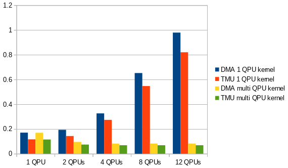

Frequently Asked Questions
--------------------------

# Table of Contents

- [What are the differences between VideoCore IV and VI?](#what-are-the-differences-between-videocore-iv-and-vi)
- [Differences in Execution](#differences-in-execution)
- [Calculated theoretical max FLOPs per QPU](#calculated-theoretical-max-flops-per-qpu)
- [Function `compile()` is not Thread-Safe](#not-thread-safe)
- [Handling privileges](#handling-privileges)
- [Issues with Old Distributions and Compilers](#issues-with-old-distributions-and-compilers)

-----


# What are the differences between VideoCore IV and VI?

There is no architecture specification available yet for `VideoCore VI`.
The stuff below is cobbled from whatever I and others have found out.
The strategy appears to be to investigate the available open source drivers.

[Source](https://www.raspberrypi.org/forums/viewtopic.php?t=244519)

## What remains the same
- The QPU pipeline stays mostly the same
- You still have an add ALU and a multiply ALU and it can issue two ALU OPs per cycle.
- There is still 4 SIMD lanes, interleaved over 4 cycles.
- The theoretical max FLOPs per QPU remains the same at two per cycle


## What is different

Here is an overview for the easily comparable stuff:

| Item                 | vc4             | v3d              | Comment |
|----------------------|-----------------|------------------|-|
| **Clock Speed :**    | 400MHz (Pi3+)   | 500MHz           | |
| **Num QPU's:**       | 12              | 8                | |
| **TMU gather limit:**|  4              | 8                | The maximum number of concurrent prefetches before QPU execution blocks |
| **Threads per QPU**  |                 |                  | *Shows num available registers in register file per thread* |
| 1 thread             | 64 registers    |  *not supported* | |
| 2 threads            | 32 registers    | 64 registers     | |
| 4 threads            | *not supported* | 32 registers     | |
| **Data Transfer**    |                 |                  | |
| DMA                  | read/write      | *not supported*  | |
| VPM                  | read only       | read/write       | |
| **Register File**    | 2x32 registers  | 1x64 registers   | |

- There was also a 'VideoCore V' (let's call it `vc5`), which was skipped in the Pis.
- `vc5` added a four thread per QPU mode, with 16 registers per thread.
- Using threads in the QPU has effect upon the available resources: e.g. for two threads, the
  TMU depth is halved (to 4) and only half the registers in a register file are available.
- `vc4` has two 32-register register files, A and B. `v3d` has a single 64-register register file.

`V3DLib` **does not implement multi-threading** and never will.
The complexity is not worth it IMHO, and the benefits dubious.
I believe that there is no performance gain to be found here, quite the contrary. 

Further:

- vc6 is clearly derived from vc4, but it is significantly different. vc6 is only a slight extension over vc5
- The instruction encoding for the QPUs is different, but the core instructions are the same.
- Instructions for packed 8 bit int math has been dropped, along with most of the pack modes.
- Instructions for packed 16 bit float math has been added (2 floats at in a single operation)
- the multiply ALU can now fadd, so you can issue two fadds per instruction.
- the add ALU has gained a bunch of new instructions.
- the A and B register files have been merged.
  You still only get an A read and a B read per instruction, but they read from one big register filei
  (which means the underlying memory block has gone from two sets of "one read port, one write port" to one "two read ports, one write port" block)
- It looks like a lot of effort has been put putting the theoretical FLOPs to better use.
- Most of the design changes have gone to improving the fixed function hardware around the QPUs.
- A fixed function blend unit has been added, which should reduce load on the QPUs when doing alpha blending.
- Some concern if software blending is still possible.
- The tile buffer can now store upto 4 render targets (I think it's up to 128bits per pixel, so if you are using 4 32bit render targets, you can't have a depth buffer)
- Faster LPDDR4 memory.
- A MMU, allowing a much simpler/faster kernel driver.
- Many more texture formats, framebuffer formats.
- All the features needed for opengl es 3.2 and vulkan 1.1
- With the threading improvements, the QPUs should spent much less time idle waiting for memory requests.

## Differences in Execution

This section records differences between the `vc4` and `v3d` QPU hardware and consequently in the instructions.

The `vc4`-specific items can be found in the "VideoCore IV Architecture Reference Guide";
the corresponding `v3d` stuff has mostly been found due to empirical research and hard thinking.

### Data Transfer

There are two transfer options, **VPM (DMA)** and **TMU**

- `vc4` has VPM for read/write and *read-only* TMU 
- `v3d` has *no* VPM<sup>[I]</sup>, but uses TMU for read/write

**VPM** can execute one read and on write in parallel, but multiple reads and multiple writes block each other.
The QPU will stall if a read has to wait on a read, or a write has to wait on a write.
It has the advantage of being able to handle multiple 16-vectors in one go.

**TMU** does not block *and* operations can overlap, up to a limit.
Up to 4 (`vc4`) or 8 (`v3d`) read operations can be performed together,
and (apparently) an unlimited number of writes.
The read/write can perform in parallel with the QPU execution.
The QPU does not need to stall at all (but it *is* possible).
However, only one 16-vector is handled per go.

**[I]**: *However, the VPM IS mentioned in the QPU registers, so it might be that I never encountered*
       *its usage for `v3d`. This might be something I may investigate when bored and nothing else to do.*

#### Comparing VPM and TMU

The following statements are the standard syntax used for transferring a 16-vector
(a block of 16 float or int values, size 64 bytes) between QPU and main memory:

    a = *ptr;
    *ptr = a;

On `vc4`, VPM was used for this by default. 
I have lived under the assumption that VPM is faster than TMU, due to online hearsay,
but I have now taken the time to check it.

I took two of the IO-intensive kernels and changed the memory access to TMU while keeping
the rest of the logic intact. This is the result:


It turns out that TMU usage is actually faster.

I examine further combinations as well with multiple QPU's (in graph `Rot3D` is used):



To be honest, I was expecting more of a difference here between VPM and TMU.
Of special note is that with kernels not optimized for multi-QPU usage, performance actually gets
worse if more QPUs are added. I was expected TMU to be vastly better here.

However, the conclusion is inescapable:

-----

**For regular usage, TMU is always faster than VPM**

-----

It might be the case that TMU is still faster if more than one 16-vector is loaded per go,
but I'm not going there.

Based on this, I am making TMU usage the default for `vc4`. DMA will still be supported and checked in
the unit tests.


### Setting of condition flags

- `vc4` - all conditions are set together, on usage condition to test is specified
- `v3d` - a specific condition to set is specified, on usage a generic condition flag is read

To elaborate:

**vc4**

Each vector element has three associated condition flags:

- `N` - Negative
- `Z` - Zero
- `C` - Complement? By the looks of it `>= 0`, but you tell me

These are set with a single bitfield in an ALU instruction.
Each flag is explicitly tested in conditions.

See: "VideoCore IV Architecture Reference Guide", section "Condition Codes", p. 28.

**v3d**

- Each vector element has two associated condition flags: `a` and `b`

To set, a specific condition is specified in an instruction and the result is stored in `a`.
The previous value of `a` is put in `b`.

See: My brain after finally figuring this out.


### Float multiplication

- `vc4`: Float multiplication on the QPU always rounds downwards
- `v3d`: Float multiplication rounds to the nearest value of the result

In other words, `v3d` will multiply as you would normally expect. The result will be identical to float multiplication on the `ARM` processor.
With `vc` however, small differences can creep in, which can accumulate with continued computation.

**Expect results to differ between CPU and QPU calculations for `vc4`.**

Of special note: the interpreter and emulator run on the ARM CPU, meaning that the outcome may be different from that from the `vc4` QPU's .


### Integer multiplication

- `vc4`: multiplication of negative integers will produce unexpected results
- `v3d`: works as expected

The following source code statements yield different results for `vc4` and `v3d`

```
    a = 16
    b = -1 * a
```

- For `vc4`, the result is `268435440`
- For `v3d`, the result is `-16`

This has to do with the integer multiply instruction working only on the lower 24 bits of integers.
Thus, a negative value gets its ones-complement prefix chopped off, and whatever is left is treated as an integer.


-----
# Calculated theoretical max FLOPs per QPU

From the [VideoCore® IV 3D Architecture Reference Guide](https://docs.broadcom.com/doc/12358545):

- The QPU is a 16-way SIMD processor.
- Each processor has two vector floating-point ALUs which carry out multiply and non-multiply operations in parallel with single instruction cycle latency.
- Internally the QPU is a 4-way SIMD processor multiplexed 4× (over PPU's) over four cycles, making it particularly suited to processing streams of quads of pixels.

So:

- 4 operations per clock cycle, when properly pipelined
- 2 ALU's per operation, when instructions uses both

So, calculation:

    op/clock per QPU = 4 [PPU's] x 2 [ALU's] = 8
    GFLOPs           = [Clock Speed (MHz)]x[num slices]x[qpu/slice]x[op/clock]

- Pi2  : 250x3x4x8 = 24.0 GFLOPs
- Pi3  : 300x3x4x8 = 28.8 GFLOPs
- Pi3+ : 400x3x4x8 = 38.4 GFLOPs
- Pi4  : 500x2x4x8 = 32.0 GFLOPs (less!)

- The improved hardware in `v3d` may compensate for performance.
- v3d adds multi-gpu-core support, each with their own set of QPUs. However, there is only one core in `v3d`.


-----
# <a name="not-thread-safe">Function `compile()` is not Thread-Safe</a>
Function `compile()` is used to compile a kernel from a class generator definition into a format that is runnable on a QPU. This uses *global* heaps internally for e.g. generating the AST and for storing the resulting statements.

Because the heaps are global, running `compile()` parallel on different threads will lead to problems. The result of the compile, however, should be fine, so it's possible to have multiple kernel instances on different threads.

As long a you run `compile()` on a single thread at a time, you're OK.


**TODO:** examine further.


-----
# Handling privileges

In order to use the `VideoCore`, special privileges are required to access certain devices files.  The default way is to run the applications with `sudo`.

You might run into the following situation (e.g.):
```
> obj-qpu/bin/detectPlatform 
Detected platform: Raspberry Pi 2 Model B Rev 1.1
Can't open device file: /dev/vcio
Try creating a device file with: sudo mknod /dev/vcio c 100 0
```
The solution for this is to become a member of group `video`:
```
> sudo useradd -g video <user>
```

Where you fill in  a relevant user name for `<user>`. To enable this, logout and login, or start a new shell.

Unfortunately, this solution will not work for access to `/dev/mem`. You will still need to run with `sudo` for any application that uses the `VideoCore` hardware.


----
# Issues with Old Distributions and Compilers

Following is known to occur with `Raspbian wheezy`.

* Certain expected functions are not defined

Following prototypes are missing in in `/opt/vc/include/bcm_host.h`:

  - `bcm_host_get_peripheral_address()`
  - `bcm_host_get_peripheral_size()`


## Compiler Limitations

When compiling with `-std=c++0x`, the following issues occur:

* Inline initialization of class variables is not allowed. E.g.:

```c++
class Klass {
   Klass(): m_value(0) {}   // <-- Use this instead

  int m_value{0};           // <-- This won't compile
}
```

* Some function definitions need explicit includes.

Known cases (there may be more):

| Function       | Needs include         |
| -              | -                     |
| `exit(int)`    | `#include <stdlib.h>` |
| `errno()`      | `#include <errno.h>`  |
| `printf()` etc | `#include <stdio.h>`  |

