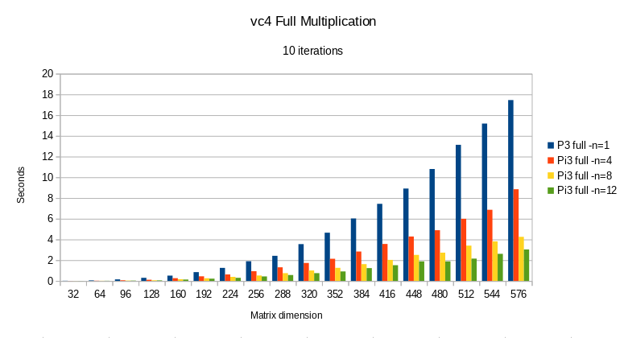
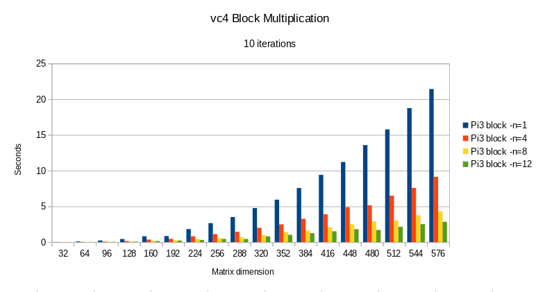
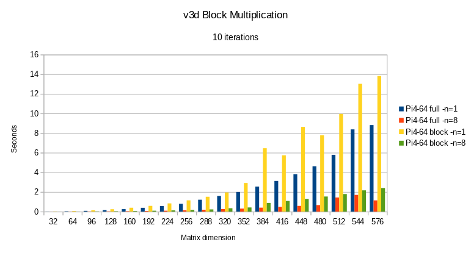
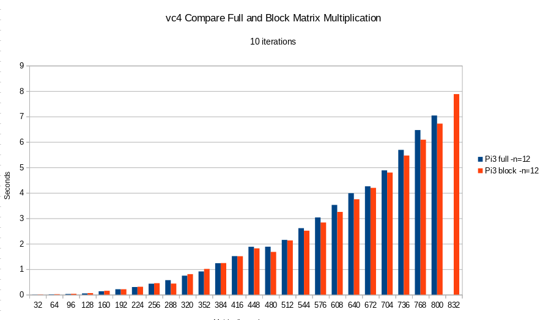
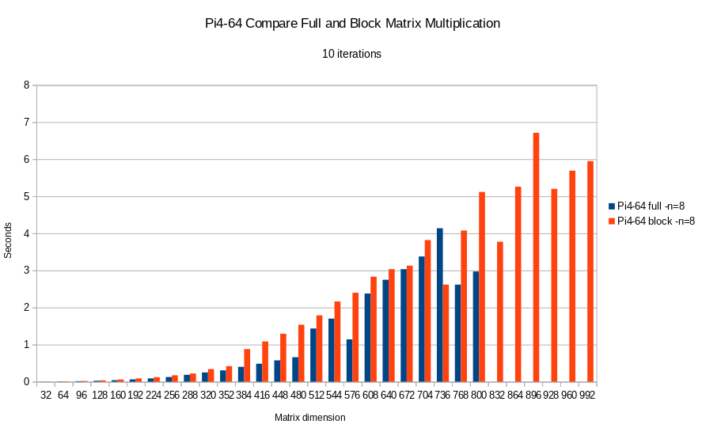
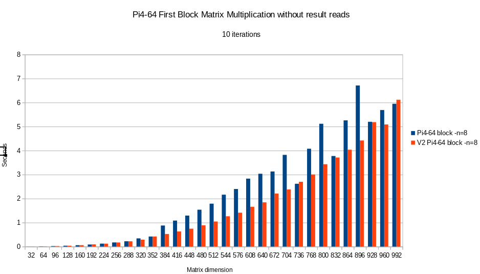
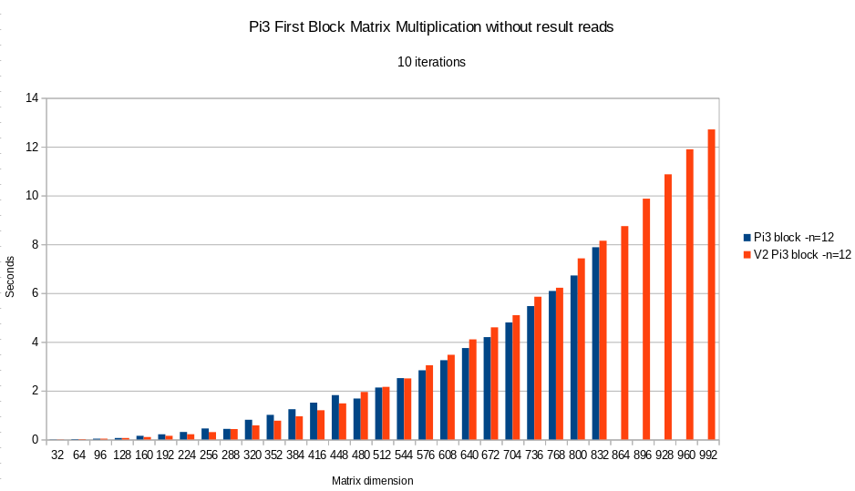

# Profiling Matrix multiplication

This compares the efficiency of *full* matrix multiplications with
[block matrix](https://en.wikipedia.org/wiki/Block_matrix) multiplications.

Block matrix multiplications were added to overcome compilation limits, notably compilation failure
due to not enough registers available.

With block matrices, a given matrix is split into sub-matrices, which are calculated separately
and then added:

```
                        | B1 |
    AxB = | A1 | A2 | x | -- | = | A1xB1 + B1xB2 |
                        | B2 |
```

The implementation handled here divides matrices into two block matrices.
Since this now works, the subdivision can be ieasily further expanded into any amount of block matrices.
There is no need for this yet, so I will leave it for now.


## Comparison of number of used QPUs

|  |  |
|:---:|:---:|
| `vc4` full multiplication | `v4c` block multiplication |

What you see here, is that the performance scales nicely with the number of used QPUs.
This is true for the full matrix calculation as well as the block calculation.

The calculation also scales for `v3d`:


From here on, the profiling times for the maximum number of QPUs will be compared for `v3d` and `vc4`.

## Comparing full and block multiplication for `vc4`



Eventually, both full and block multiplications fail due to 'insuffient register capacity'.
The full multiplication fails at dimension 832x832, block multiplication fails at 864x864.

Interestingly, for large matrix dimensions, the block multiplication is slightly more
efficient than the full multiplication.
This is due to block multiplication needing less computations overall (*citation needed*);
this is the basis of many Fast Fourier Transforms (FFT).


# Comparing full and block multiplication for `v3d`



The full multiplication fails at dimension 832x832 due to not enough registers available.
Block multiplication fails at 1024x1024, but due to not enough shared memory being available
(default: 10MB). This means that the range of block multiplication can be further expanded
by increasing the size of shared memory.

The throughput is more erratic than on `vc4`. This can be explained by the fact that
`v3d` uses TMU for both reads and writes, which go via a cache. You need to be a bit lucky
with the cache misses on reads.
`vc4` reads using TMU and writes using DMA, therefore it doesn't have this effect. 

Also, the full multiplication has overall better throughput than the block multiplication.
This is due to extra reads being added to sum partial block results.
This should be improved by prefetching, but I haven't figured it out yet for this case.

# Further Optimization

While doing this profiling, it struct me that the first block multiplication does not need
to retrieve result values for addition, since these are zero anyway.
Implementing this results in:



For `v3d`, the throughput is overall faster and more stable.



For `vc4`, the difference is not too staggering. This would be expected.
As a very minor point, block mult just slightly beats full mult for dimension <= 544.
After that, it becomes slower.

The bonus here is that the max dimension has been raised, to the same as `v3d` (992x992);
